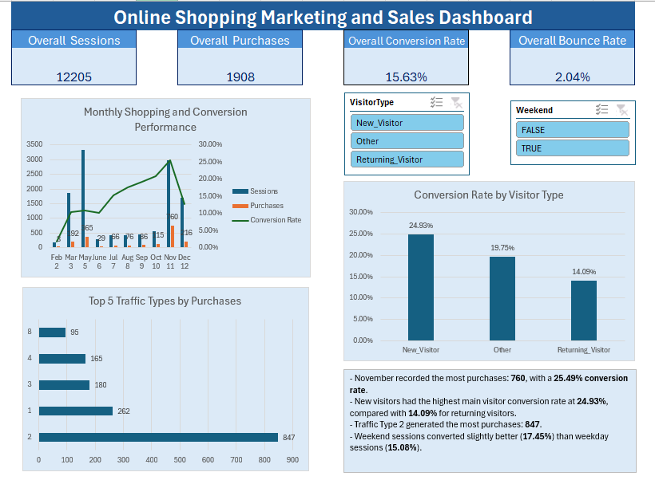

# online-shoppers-excel-dashboard
Interactive Excel dashboard analyzing online shoppers’ behaviour, conversion patterns and visitor segments.

# Online Shoppers Purchasing Intention Dashboard

## Project Overview

This project presents an interactive Excel dashboard analysing online shoppers’ behaviour and purchasing intentions. The dashboard helps identify conversion patterns across visitor types, months and traffic sources.

## Dashboard Preview

## Business Questions

- How many visitors completed a purchase?
- What is the overall conversion rate?
- Which months recorded the highest purchasing activity?
- Which visitor type generated the most purchases?
- Which traffic sources brought the most visitors?
- How do purchasing patterns change when dashboard filters are applied?

## Tools Used

- Microsoft Excel
- PivotTables
- PivotCharts
- Slicers
- Excel formulas
- Data cleaning and duplicate removal

## Data Preparation

- Reviewed the dataset for missing and inconsistent values.
- Identified and removed 125 duplicate records.
- Retained 12,205 records for analysis.
- Prepared the cleaned data for PivotTable analysis.
- Created interactive slicers to filter the dashboard.

## Dashboard Features

- Purchase and visitor summary
- Monthly purchasing analysis
- Visitor-type segmentation
- Traffic-source analysis
- Interactive dashboard slicers

## Key Insights

- Returning visitors demonstrated stronger purchasing activity than other visitor groups.
- Purchasing behaviour varied across different months.
- Traffic sources contributed different levels of visitor and purchase activity.
- Interactive slicers allow users to explore specific customer segments.

## Repository Structure

├── dashboard/
│   └── online_shoppers_dashboard.xlsx
├── data/
│   └── online_shoppers_raw.csv
├── images/
│   └── dashboard_preview.png
└── README.md

## Dataset Source

Online Shoppers Purchasing Intention Dataset from the UCI Machine Learning Repository.

## Author

Khadijah Sofia Anuar
Bachelor of Computer Science (Hons.), specialising in Big Data
Universiti Teknologi MARA (UiTM)
